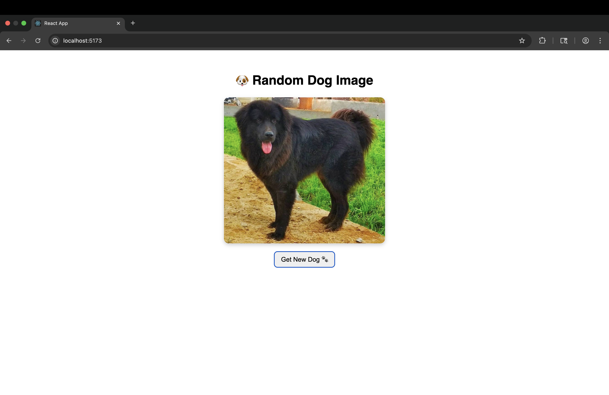

# Random Dog Image App 🐶

A simple React app that fetches and displays a random dog image from the [Dog CEO API](https://dog.ceo/dog-api/).  
Users can click a button to fetch a new image, with a loading message shown while the request is in progress.

## Features
- Fetches a random dog image on page load.
- Button to load a new dog image on demand.
- Loading indicator while fetching data.
- Error handling for failed requests.

## Technologies
- React (useState, useEffect)
- Fetch API
- CSS for basic styling

## Screenshot


## Setup
1. Clone this repository
2. Install dependencies:
   ```bash
   npm install

## Start the development server
1. npm run dev

## Licence
This project is open source and available under the MIT License.